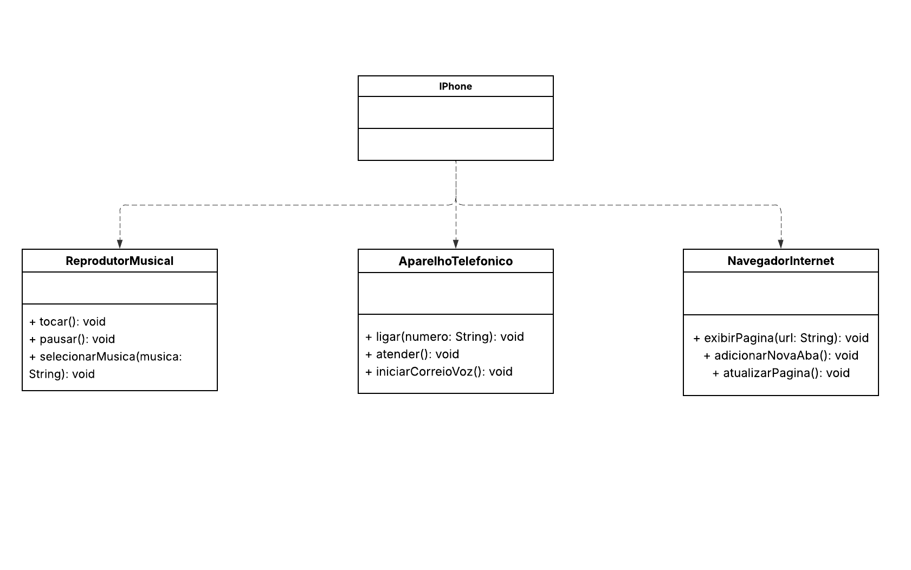

# 📱 Projeto Java - Modelagem de Componente iPhone

Este projeto simula a modelagem orientada a objetos do componente **iPhone**, com base em sua apresentação oficial de 2007. O objetivo é representar em **UML** e implementar em **Java** suas principais funcionalidades: reprodutor musical, aparelho telefônico e navegador de internet.

## 🔧 Funcionalidades

A classe `iPhone` implementa três interfaces:

- **ReprodutorMusical**
    - `tocar()`
    - `pausar()`
    - `selecionarMusica(String musica)`

- **AparelhoTelefonico**
    - `ligar(String numero)`
    - `atender()`
    - `iniciarCorreioVoz()`

- **NavegadorInternet**
    - `exibirPagina(String url)`
    - `adicionarNovaAba()`
    - `atualizarPagina()`

## 🧩 Estrutura UML

Abaixo está o diagrama UML representando a relação entre a classe `iPhone` e as três interfaces que ela implementa:

